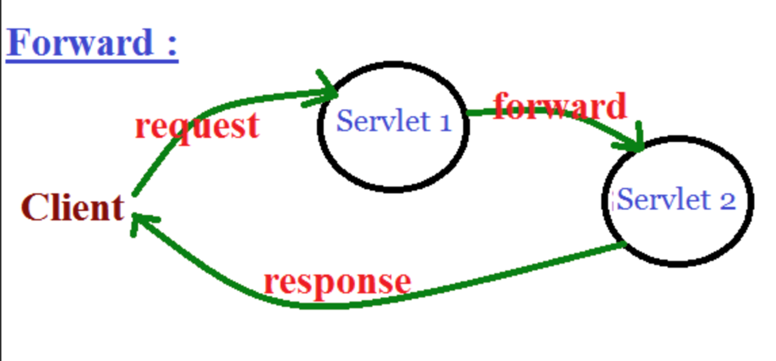

# 12. 포워드(forward)

#### [포워드]

----



1. 웹 브라우에서 Servlet 1에게 **요청**을 보냄
2. Servlet 1이 **요청 처리**후, 그 **결과를 HttpServletRequest에 저장**
3. Servlet 1은 **결과가 저장된 HttpServletRequest**와 **응답을 위한 HttpServletResponse**를 같은 웹 어플리케이션 내에 있는 Servlet 2에게 전송 ( **= forward** )
4. Servlet 2는 Servlet 1으로 부터 받은 HttpServletRequest와 HttpServletResponse를 이용해 **요청 처리후 웹브라우저에게 결과 전송**

<br>

#### [서블릿에서 포워드 사용하기]

----

```java
protected void service(HttpServletRequest request, HttpServletResponse response) throws ServletException, IOException {
		// TODO Auto-generated method stub
	}
```

:  service 메서드를 이용해 포워드 구현 (request , response 존재)

<br>

#### [리다이렉트와 포워드 차이]

----

- **리다이렉트** 

  : 클라이언트가 서버한테 요청을 보내고, 서버가 요청 처리후, **클라이언트에게 새로 요청 처리할 곳을 알려주고 해당 위치로 다시 요청하라고 알려주는 것**

  : 그래서 **URL 주소가 변경되는 걸 확인할 수 있다.**

- **포워드**

  :클라이언트가 서버한테 요청을 보내고, 서버가 요청 처리후, **서버에서 다른 위치에게 처리를 맡기는 것**.

  : 클래이언트는 요청보낸 서블릿이 혼자 다 처리했는지, 여럿이서 처리되었는지 구분 X

  : 그래서 **URL 주소가 변경되지 않는다**.

  <br>

**[이둘의 차이점 구분이 중요한 이유]**

​	: 웹 브라우저가 서블릿에 요청하는건 request, 반대로 응답결과 보여주는게 response.

​    : request와 response는 처리될때까지 유지

​	: 이때, **포워드는 request와 response가 한번씩 발생** (서버가 내부적으로 옮겨주기에 여러번 발생 X)

​	: **리다이렉트는 request, response가 여러번 발생** (redirect1, 2의 request, response가 구분됨)

​	: **요청의 개수의 차이가 주요 차이점**

<br>

#### [Forward 실습]

----

: FrontServlet (/front) 에서 랜덤 주사위값 구하고, 그값을 NestServlet (/next)에서 전달 받은 주사위 값만큼 "hello" 출력하기

```java
// 1. FrontServlet

...
protected void service(HttpServletRequest request, HttpServletResponse response) throws ServletException, IOException {
		int diceValue = (int)(Math.random() * 6) + 1;
		
		// 결과가 저장된 HttpServletRequest
    
    	// 1. setAttribute를 이용해 값을 잠시 맡겨놓는다 
    	// (입력한 변수명에 저장후 추후 찾을때 해당 변수명이용해 찾음)
		request.setAttribute("dice", diceValue);  
		
    	// 2. 어디로 이동할지 지정(같은 어플리케이션 내에서만 이동가능)
		RequestDispatcher requestDispatcher = request.getRequestDispatcher("/next"); 
    
    	// 3. forward 메서드 실행해 결과저장된 request와 응답위한 response 전송
		requestDispatcher.forward(request, response);
	}
```

```java
// 2. NestServlet

...
protected void service(HttpServletRequest request, HttpServletResponse response) throws ServletException, IOException {
		response.setContentType("text/html");
		PrintWriter out = response.getWriter();
		out.println("<html>");
		out.println("<head><title>form</title></head>");
	    out.println("<body>");

	    // 저장했던 값 변수명 이용해 불러오기
        int dice = (Integer)request.getAttribute("dice");
        out.println("dice : " + dice);
        for(int i = 0; i < dice; i++) {
            out.print("<br>hello");
        }
        out.println("</body>");
        out.println("</html>");
	}
```


