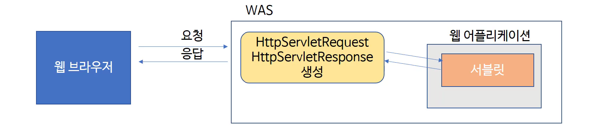

# 6. 요청과 응답

#### [요청과 응답]

------



- WAS는 **웹 브라우저로부터 Servlet 요청을 받으면**
  - 요청할때 가지고 있는 정보를 **HttpServletRequest객체를 생성**하여 저장
  - 웹 브라우저에게 응답을 보낼 때 사용하기 위하여 **HttpServletResponse 객체를 생성**
  - 생성된 HttpServletRequest, HttpServletResponse 객체를 서블릿에게 전달
- **HttpServletRequest**
  - http 프로토콜의 request 정보를 서블릿에게 전달하기 위한 목적으로 사용
  - **헤더정보, 파라미터, 쿠키, URI, URL 등의 정보를 읽어 들이는 메소드 보유**
  - **Body의 Stream을 읽어들이는 메소드 보유**
- **HttpServletResponse**
  - WAS는 어떤 클라이언트가 요청을 보냈는지 알고 있고, **해당 클라이언트에게 응답을 보내기 위한 이 객체를 생성해 서블릿에게 전달**
  - 서블릿은 해당 객체를 이용하여 content type, 응답코드. 응답 메세지등을 전송

<br>

#### [실습]

------

- 웹 브라우저가 요청정보에 담아서 보내는 헤더값을 읽어 들여 브라우저 화면에 출력

- http://localhost:8080/firstweb/header

- package name : examples

- class name : HeaderServlet

- url mapping : /header

  ````java
  import java.io.IOException;
  import java.io.PrintWriter;
  import java.util.Enumeration;
  ...
  
  protected void doGet(HttpServletRequest request, HttpServletResponse response) throws ServletException, IOException {
  		response.setContentType("text/html");
  		PrintWriter out = response.getWriter();
  		out.println("<html>");
  		out.println("<head><title>form</title></head>");
  		out.println("<body>");
  		
      	// 모든 헤더 이름들을 가져오는 request 메서드, enumeration 객체로 변환
  		Enumeration<String> headerNames = request.getHeaderNames();  
         
  		while(headerNames.hasMoreElements()) {
  			String headerName = headerNames.nextElement();
              
              // header의 각 정보를 알아낼수 있는 request 메서드
  			String headerValue = request.getHeader(headerName);   
  			out.println(headerName + " : " + headerValue + " <br> ");
  		}		
  		
  		out.println("</body>");
  		out.println("</html>");
  	}
  
  
  	protected void doPost(HttpServletRequest request, HttpServletResponse response) throws ServletException, IOException {
  		doGet(request, response);
  	}
  ````

  ```
  // 결과 예시
  accept : image/gif, image/jpeg, image/pjpeg, application/x-ms-application, application/xaml+xml, application/x-ms-xbap, */* 
   accept-language : ko 
   cache-control : no-cache 
   ua-cpu : AMD64 
   accept-encoding : gzip, deflate 
   user-agent : Mozilla/5.0 (Windows NT 6.2; Win64; x64; Trident/7.0; rv:11.0) like Gecko 
   host : localhost:8080 
   connection : Keep-Alive 
  ```

  : [HTTP header](https://developer.mozilla.org/en-US/docs/Web/HTTP/Headers)

<br>

#### [실습2 - 파라미터 읽어 들이기]

----

- **URL 주소의 파라미터 정보를 읽어 들여 브라우저 화면에 출력**

- http://localhost:8080/firstweb/param?name=kim&age=5

- package name : examples

- class name : ParameterServlet

- url mapping : /param

  ```
  	String name = request.getParameter("name");
  	String age = request.getParameter("age");
  		
  	out.println("name : " + name + "<br>");
  	out.println("age : " +age + "<br>");
  ```

  : 와 같이 링크에 있는 파라미터를 변수를 저장해 사용