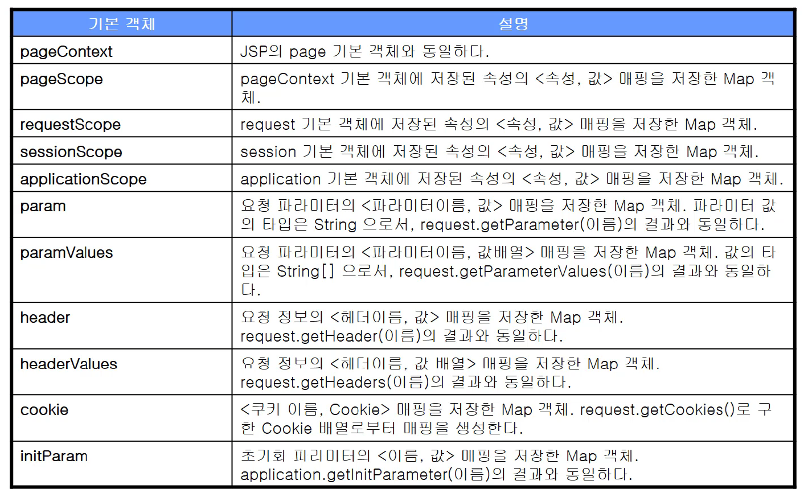

# 15. EL(Expression Language)

#### [표현 언어 EL]

----

: **값을 표현하는데 사용 되는 스크립트 언어**

: **JSP의 기본 문법을 보완**하는 역할. ( JSP에서 기존 JAVA 언어 외로 사용하는 언어중 하나 )

: JSP가 백엔드 개발자 or 프론트엔드 개발자가 다뤄야 하는 영역은.. 아님.. 섞여있움.. 이를 효율적으로 쓰기 위한방법중 하나

<br>

#### [EL이 제공하는 기능]

----

- **JSP의 스코프(scope)에 맞는 속성 사용** : 앞에서 본 4개의 scope 쉽게 출력 가능

- **합 객체에 대한 접근 방법 제공** : collection, 내장 객체에 대한 효육적인 접근 방법
- **수치연산, 관계연산, 논리연산자** 제공
- **자바 클래스 메소드 호출 기능** 제공
- **자체 기본 객체** 제공

<br>

#### [EL의 표현 방법]

---

```
// EL기본 문법
${expr}


// EL 예제
<jsp:include page="/module/${skin.id}/header.jsp" flush="true" />?
<b> %{sessionScope.member.id}</b>님 환영합니다.
```

: JSP의 **스크립트 요소(스크립트릿, 표현식, 선언부)를 제외한 나머지 부분**에서 사용가능

: 표현식을 통해 표현식보다 편리하게 값 출력이 가능

<br>

#### [EL 기본 객체]

----


- 네가지 session에 관한 객체
- 초기화 파라미터 읽어들이는 파라미터 등.. 존재

<br>

#### [EL 기본 객체 사용 예시]

-----

```jsp
...
<body>
요청 URL: ${pageContext.request.requestURI} <br>
request의 name 속성 : ${requestScope.name} <br>    // request.getAttribute("name")
code 파라미터 ${param.code}                        // request.getParameter("code")
</body>
...
```

: 기존 자바 코드 사용 대신 EL 이용해 깔끔하게 작성 가능

<br>

#### [EL의 데이터 타입]

----

- 불리언 타입 - true와 false
- 정수타입 - 0~9로 이루어진 정수 값 음수의 경우 '-'가 붙음
- 실수타입 - 0~9로 이루어져 있으며, 소수점('.')을 사용할 수 있고, 3.24e3과 같이 지수형으로 표현 가능하다.
- 문자열 타입 - 따옴표( ' 또는" )로 둘러싼 문자열. 만약 작은 따옴표(')를 사용해서 표현할 경우 값에 포함된 작은 따옴표는 \' 와 같이 \ 기호와 함께 사용해야 한다.
- \ 기호 자체는 \\ 로 표시한다.
- 널 타입 - null

<br>

#### [객체 접근 규칙]

----

```
// 객체 접근 규칙 문법
${<표현1>,<표현2>}
```

: 표현1 or 표현2가 **null이면 null을 반환**

:**표현1이 Map**일 경우  **표현2를 key**로한 값을 반환한다.

: **표현1이 List나 배열**이면 **표현2가 정수일경우 해당 정수번째 index에 해당하는 값 반환**

: **정수 아니면 오류** 발생

: **표현1이 객체**일 경우 **표현2에 해당되는 getter메소드에 해당하는 메소드를 호출한 결과를 반환**

<br>

#### [EL의 수치 연산자]

----

- \+ : 덧셈
- \- : 뺄셈
- \* : 곱셈
- / 또는 div : 나눗셈
- % 또는 mod : 나머지

```
// 1. 숫자 + 숫자가 아닌 객체 : 숫자로 변환후 연산자 수행
${"10"+1} → ${10+1}

// 2. 숫자 + 숫자가 아닌 객체(숫자로 변환 불가능) : 에러
${"열"+1} → 에러

// 3. null + 객체 : null을 0으로 처리후 계산
${null + 1} → ${0+1}
```

<br>

#### [EL의 비교 연산자]

----

- == 또는 eq
- != 또는 ne
- < 또는 lt
- \> 또는 gt
- <= 또는 le
- \>= 또는 ge
- 문자열 비교: ${str == '값'} str.compareTo("값") == 0 과 동일

<br>

#### [EL의 논리 연산자]

----

- && 또는 and
- || 또는 or
- ! 또는 not

<br>

#### [EL의 empty 연산자, 비교 선택 연산자]

---

1. **empty 연산자**

   ```
   empty <값>
   ```

   - 값이 null : true 리턴
   - 값이 ""(빈문자열) : true 리턴
   - 값이 길이가 0인 배열 : true
   - 값이 빈 map : true
   - 값이 빈 Collection : true
   - 이 외의 경우 : false 리턴

2. **비교 선택 연산자**

   ```
   <수식> ? <값1> : <값2>    // true면 값1 실행, false면 값2 실행
   ```

<br>

#### [EL 연산자 우선순위]

----

1. [] .
2. ()
3. \- (단일) not ! empty
4. \* / div % mod
5. \+ -
6. < > <= >= lt gt le ge
7. == != eq ne
8. && and
9. || or
10. ? :

<br>

#### [EL 언어 비활성화 하는 법]

----

```jsp
<%@ page isELIgnored = "true" %>
```

: true를 지정해주면 EL 언어 비활성화 된다.

: JSP에 명시

: **서블릿 버전 2.4부터 EL 언어 사용 default 설정**

: 그 이전 버전에서는 EL이 무시되고 있다.


