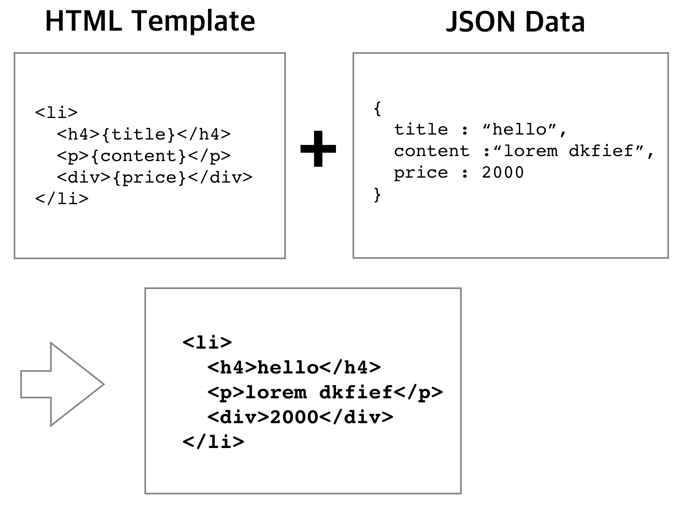

# 31. 웹 UI

#### [1. 서비스 개발을 위한 JS CSS 디렉토리 구성]

----

- **JavaScript 파일 구성**

  : 간단한 내용의 JS면 **한 페이지에 모두 표현하는 것도 좋다.**

  : 그렇지 않으면 의미에 맞게 구분하는 방법이 더 좋다.


- **HTML 안에 JS 구성**

  : CSS는 **head 태그안에 상단에 위치**

  : JS는 **body 태그 닫히기 전에 소스파일간 의존성 이해해서 순서대로 배치**

<br>

#### [2. DOMContentLoaded와 load]

---

- **DOMContentLoaded와 load 이벤트의 차이점**

  : DOMContentLoaded는 load와 달리 **이미지, 스타일 시트가 전부 읽히기 전에 먼저 로딩**된다.

  : 반면 load는 **화면에 있는 모든 요소를 읽은 이후에 보여주는 경우**

  : 그래서 load의 위치가 head 안에 있으면 속도가 느려질수있다.

  

- **DOM Tree 분석 끝나면 DOMContentLoaded 이벤트 발생, 그외 모든 자원 다 받아져서 브라우저에 렌더링 까지 끝난 시점에는 Load 발생**

  ```
  document.addEventLister("DOMContentLoaded", function(){...})
  ```

  : **대부분의 JS코드는 DOmContentLoaded 이후에 동작**

  : DomContentLoaded는 IE 8 이하에서는 지원 X, jquery ready와 같은 기능.


<br>

#### [3. 버블링과 캡처링]

---

: https://ko.javascript.info/bubbling-and-capturing (링크보는게 확실!)

- **list 내부 요소 각각에 addEventLister를 통해 이벤트 등록하는 방법**

  ```js
  var lists = document.querySelectorAll("ul > li");
  
  for(var i =0, len=lists.length; i<len; i++){
  	lists[i].addEventListener("click", funcion(evt){
  		// 실행할 것. evt.currentTarget.firstChild.src; 식으로 사용 가능
  	})
  }
  ```

  : **비효율적**. list 많아질수록 브라우저가 기억해야할 이벤트 리스너도 많아짐.

  ```js
  // 해결책. ul 태그에만 이벤트를 새롭게 등록
  ul.addEventListener("click", funcion(evt){
  		// 실행할 것. evt.currentTarget.firstChild.src; 식으로 사용 가능
  	})
  ```

  - **이벤트 버블링(bubbling)**

    : 클릭한 지점이 하위엘리먼트(ul내부의 li, img)라고 해도, 그것을 감싸고 있는 상위 엘리먼트까지 올라가 이벤트리스너 탐색.

  - **이벤트 캡처링(Capturing)**

    : 캡처링(Capturing)은 중첩된 이벤트를 window 부터 타겟 엘리먼트로 내려오며 실행.

  <br>

  #### [4. Event delegation(이벤트 위임)]

  ---

  : 부모 요소가 자식 요소의 이벤트 처리를 위임받는 것.

  : 적용시 이벤트 처리 안되있는 부분에 대해 클릭 이벤트 발생시 불필요한 이벤트 발생할수도 있음.

  ```js
  // 예제
  var ul = document.querySelector("ul");
  ul.addEventListener("click",function(evt) {
      if(evt.target.tagName === "IMG") {
        log.innerHTML = "clicked" + evt.target.src;
      }
  });
  
  
  // img 태그는 padding 값이 있어 img태그와 li 태그 사이에 공백이 존재.
  // 이 공백 클릭해도 이미지 url 출력할수 있게끔.
  var ul = document.querySelector("ul");
  ul.addEventListener("click",function(evt) {
    debugger;
      if(evt.target.tagName === "IMG") {
        log.innerHTML = "clicked" + evt.target.src;
      } else if (evt.target.tagName === "LI") {
        log.innerHTML = "clicked" + evt.target.firstChild.src;
      }
  });
  ```

<br>

#### 5. HTML Templating

----

: 서버로 부터 받은 데이터를 화면에 반영할때 사용.

#### [HTML Teplating 작업]

: **반복적인 HTML부분을 template으로 만들어두고, 서버에서 온 데이터(JSON등)을 결합해, 화면에 추가작업**



```js
// 간단히 구현.
var data = {  title : "hello",
              content : "lorem dkfief",
              price : 2000
           };
var html = "<li><h4>{title}</h4><p>{content}</p><div>{price}</div></li>";

html.replace("{title}", data.title)
    .replace("{content}", data.content)
    .replace("{price}", data.price)
```

: https://jonsuh.com/blog/javascript-templating-without-a-library/

: [HTML templating 실습](https://www.edwith.org/boostcourse-web/lecture/20732/)

```js
var data = [
        {title : "hello",content : "lorem dkfief",price : 2000},
        {title : "hello",content : "lorem dkfief",price : 2000}
];

//html 에 script에서 가져온 html template.
var html = document.querySelector("#template-list-item").innerHTML;

var resultHTML = "";

for(var i=0; i<data.length; i++) {
    resultHTML += html.replace("{title}", data[i].title)
                      .replace("{content}", data[i].content)
                      .replace("{price}", data[i].price);
}

document.querySelector(".content").innerHTML = resultHTML;
```

