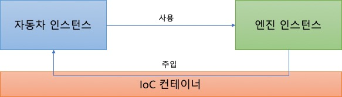

# 34. Spring IoC/DI 컨테이너

#### [컨테이너(Container)]

---

: **인스턴스의 생명주기 관리**

: **생성된 인스턴스들에게 추가적인 기능 제공**

: 인스턴스 생성, 실행, 소멸 작업들을 직접하지 않고 대신해주는 역할

ex) 서블릿 실행해주는 WAS는 서블릿 컨테이너를 가지고 있다 할 수 있다.

- 서블릿 클래스를 실제로 메모리에 올리고 실행하는 것은 WAS의 서블릿 컨테이너의 역할
- 또한 동일한 서블릿에 해당하는 요청 받을시, 또 메모리에 올리지 않고 메모리에 올라가있는 기존 서블릿 실행해 웹 브라우저에 전달 함

<br>

#### [IOC]

----

: Inversion of Control (제어의 역전)

: 개발자가 프로그램의 흐름을 제어하는 코드를 일반적으로 작성. 

  But, 이 흐름의 제어를 개발자가 하는게 아니라 **다른 프로그램이 그 흐름을 제어하는 것**을 의미.

```
대부분의 프레임워크에서 사용하는 방법.
개발자는 프레임워크에 필요한 부품을 개발, 조립하는 방식의 개발을 한다.
이렇게 조립된 코드의 최종 호출은 개발자에 의해서 제어되는게 아니라, 
프레임워크 내부에서 결정된 대로 이뤄지는데 이러한 현상을 말함.
```

ex) TV가 여러개일때 이를 조절하는 리모컨의 규격이 다르면 불편.. 그래서 TV 제조사들은 리모컨의 규격을 통일(인터페이스) 한다.프로그래밍 코드도 마찬가지

<br>

#### [DI]

---

: Dependency Injection (의존성 주입)

: 제어의 역전이 일어날때 스프링이 내부에 있는 **객체들간의 관계를 관리할 때 사용하는 기법**

: **클래스 사이의 의존 관계**를 빈(Bean) 설정 정보를 바탕으로 컨테이너가 자동으로 연결해주는 것.

ex) 자바에서는 일반적으로 인터페이스 이용해 의존적 객체 관계 최대한 유연하게 처리하게 해준다.

<br>

- **DI 적용 예시**

  

  ```java
  // DI 적용 안된 예 : 개발자가 직접 인스턴스를 생성
  
  class 엔진 {
  ...
  }
  
  class 자동차 {
  	엔진 v5 = new 엔진();   // 인스턴스 직접 생성
  }
  ```

  

  ```java
  // Spring에서 DI 적용 예
  @Component
  class 엔진 {
  ...
  }
  
  @Component
  class 자동차 {
  	@Autowired     // 컨테이너에 이 작업 맡김
  	엔진 v5;        // new 안해도 인스턴스 생성됨.
  }
  ```

<br>

#### [Spring에서 제공하는 IoC/DI 컨테이너]

----

: 스프링이 가진 공장

- **BeanFactory : IoC/DI에 대한 기본 기능 가지고 있다**

- **ApplicationContext**

  : BeanFactory보다 권장됨

  : BeanFactory 모든 기능 포함 + 트랜잭션처리, AOP 처리등 가능

  :  BeanPostProcessor, BeanFactoryPostProcessor등을 자동으로 등록

  : 국제화 처리, 어플리케이션 이벤트 등을 처리가능