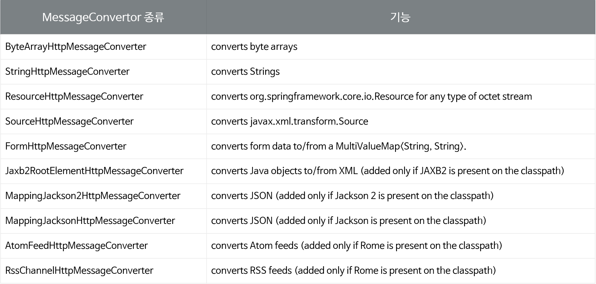

# 43. RestController

: **Rest API 작성 위해 Spring MVC에서 제공하는 @RestController**

<br>

#### [@RestController]

---

: Spring 4에서 Rest API 또는 Web API를 개발하기 위해 등장한 애노테이션.

: 이전버전읜 @Controller, @Responsebody 포함.

<br>

#### [MessageConvertor]

-----

: RestController를 사용하기 위해서 매우 중요.

: **외부에서 전달 받는 JSON을 내부에서 사용가능한 객체로 변환 or 그 반대 역할 수행**

: **@EnableWebMvc** 사용하면 기본으로 제공.

<br>

#### [MessageConvertor의 종류]

----

: 아래와 같은 다양한 Convertor들이 제공된다.



<br>

#### [JSON 응답하기]

---

: JSON으로 변환하기 위해 기본적으로 **jackson 라이브러리 사용**

: 그래서 jackson 라이브러리 추가 안되있으면, convertor 등장안해서 **500번 오류 발생**

: **Jackson 라이브러리 추가해야 제대로 사용 가능**

<br>

#### [RestController 실습]

----

: 앞에서 만든 guestbook 실습에다가 웹 API 추가하기

1. **Jackson 라이브러리 추가**

   ```xml
   // pom.xml
   <!--  Jackson Module  -->
           <dependency>
               <groupId>com.fasterxml.jackson.core</groupId>
               <artifactId>jackson-databind</artifactId>
               <version>${jackson2.version}</version>
           </dependency>
           
           <dependency>
               <groupId>com.fasterxml.jackson.datatype</groupId>
               <artifactId>jackson-datatype-jdk8</artifactId>
               <version>${jackson2.version}</version>
           </dependency>
   ```

   <br>

2. **Controller 패키지에 RestController 생성 (GuestbookApiController 클래스)**

   ```java
   package kr.or.connect.guestbook.controller;
   
   import java.util.ArrayList;
   import java.util.Collections;
   import java.util.HashMap;
   import java.util.List;
   import java.util.Map;
   
   import javax.servlet.http.HttpServletRequest;
   
   import org.springframework.beans.factory.annotation.Autowired;
   import org.springframework.web.bind.annotation.DeleteMapping;
   import org.springframework.web.bind.annotation.GetMapping;
   import org.springframework.web.bind.annotation.PathVariable;
   import org.springframework.web.bind.annotation.PostMapping;
   import org.springframework.web.bind.annotation.RequestBody;
   import org.springframework.web.bind.annotation.RequestMapping;
   import org.springframework.web.bind.annotation.RequestParam;
   import org.springframework.web.bind.annotation.RestController;
   
   import kr.or.connect.guestbook.dto.Guestbook;
   import kr.or.connect.guestbook.service.GuestbookService;
   
   @RestController    // restcontroller임을 알리는 어노테이션
   @RequestMapping(path="/guestbooks")    // 해당 API 클래스 안에는 같은 매핑으로 여러개를 수행 => 이 어노테이션 붙은 클래스 내부요소들 다 공통 사용 가능
   public class GuestbookApiController {
   
   	@Autowired    // 서비스 사용위한 어노테이션
   	GuestbookService guestbookService;
   	
   	
   	@GetMapping   // path가 /guestbooks라고 시작하면서 Get 방식으로 요청들어오면 아래 메서드 실행
   	// json 요청을 받아 map 방식으로 return
   	public Map<String, Object> list(@RequestParam(name="start", required=false, defaultValue="0") int start) { 
   		
   		List<Guestbook> list = guestbookService.getGuestbooks(start);
   		
   		int count = guestbookService.getCount();
   		int pageCount = count / GuestbookService.LIMIT;
   		if(count % GuestbookService.LIMIT > 0)
   			pageCount++;
   		
   		List<Integer> pageStartList = new ArrayList<>();
   		for(int i = 0; i < pageCount; i++) {
   			pageStartList.add(i * GuestbookService.LIMIT);
   		}
   		
   		Map<String, Object> map = new HashMap<>();
   		map.put("list", list);
   		map.put("count", count);
   		map.put("pageStartList", pageStartList);
   		
   		return map;
   	}
   	
   	
   	@PostMapping  // post 요청 들어오면 write 메서드 호출
   	// json 메서드로 변환되어서 Guestbook 객체 반환
   	public Guestbook write(@RequestBody Guestbook guestbook,
   						HttpServletRequest request) {
   		String clientIp = request.getRemoteAddr();
   		// id가 입력된 guestbook이 반환된다.
   		Guestbook resultGuestbook = guestbookService.addGuestbook(guestbook, clientIp);
   		return resultGuestbook;
   	}
   	
   	
   	@DeleteMapping("/{id}")   // /guestbook/id 정보 오면 
   	public Map<String, String> delete(@PathVariable(name="id") Long id,  // pathvariable로 값 읽어들이느 중
   			HttpServletRequest request) {
   		String clientIp = request.getRemoteAddr();
   		
   		int deleteCount = guestbookService.deleteGuestbook(id, clientIp);
   		return Collections.singletonMap("success", deleteCount > 0 ? "true" : "false"); // Map 객체 생성 성공하면 sucess 반환
   	}
   	
   }
   ```

   <br>

3. **작성한 RESTAPI 테스트**

   : 크롬 브라우저에서 Restlet Client 라는 확장 프로그램 사용하는 방법.

   : 테스트 방법 생략.