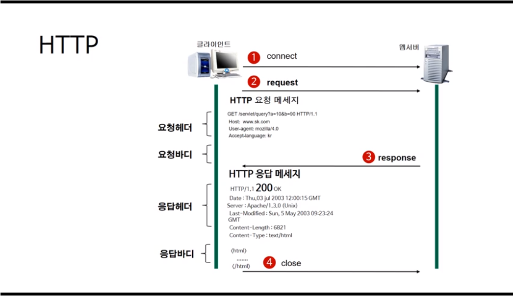

# 1. HTTP 프로토콜 이해 (웹의 동작)

#### [HTTP란]

----

: Hypertext Transfer Protocol

: **서버와 클라이언트가 인터넷상에서 데이터를 주고받기 위한 프로토콜(protocol)**

: 현재 HTTP/2 버전 등장 상태

 

#### [HTTP 작동 방식]

----

: **서버/클라이언트 모델**을 따른다

- **장점**
  - **불특정 다수**를 대상으로 하는 서비스에 적합
  - 클라이언트와 서버가 계속 연결된 형태가 아니기 때문에 서버 간의 최대 연결 수 보다 훨씬 많은 요청과 응답 처리가능
- **단점**
  - 연결을 끊어버리기 때문에, **클라이언트의 이전 상황을 알수가 없다**
  - = **무상태(Stateless)**
  - 이런 특징때문에 정보 유지위하 **Cookie**와 같은 기술 등장

 

#### [URL(Uniform Resource Locator)]

---

: 인터넷상에 자원의 위치

: **특정 웹 서버의 특정 파일에 접근하기 위한 경로 혹은 주소**

- **요청 메서드 : GET, PUT, POST, PUSH, OPTIONS 등의 요청 방식이 온다**

- 요청 URL : 요청하는 자원의 위치를 명시

-  HTTP 프로토콜 버전 : 웹 브라우저가 사용하는 프로토콜 버전

- **첫번째 줄 요청메소드는 서버에게 요청의 종류를 알려주기 위해 사용**

  (최초의 웹서버는 GET 방식만 지원)

  - **GET : 정보를 요청하기 위해서 사용. (SELECT)**
  - **POST** : 정보를 밀어넣기 위해서 사용한다. (INSERT)
  - **PUT** : 정보를 업데이트하기 위해서 사용한다. (UPDATE)
  - **DELETE** : 정보를 삭제하기 위해서 사용한다. (DELETE)
  - **HEAD** : (HTTP)헤더 정보만 요청한다. 해당 자원이 존재하는지 혹은 서버에 문제가 없는지를 확인하기 위해서 사용한다.
  - **OPTIONS** : 웹서버가 지원하는 메서드의 종류를 요청한다.
  - **TRACE** : 클라이언트의 요청을 그대로 반환한다. 예컨데 echo 서비스로 서버 상태를 확인하기 위한 목적으로 주로 사용한다.

 

#### [HTTP와 HTTPS]

------

: HTTP에 **Security(보안)**이 더하진 형태

: **서버와 브라우저 사이에 전송하는 정보를 보호**

: 암호화가 추가되어 주로 전자상거래나 회사 보안 통신에 활용

: .TLS. 즉 SSL(Secure Socket Layer) 프로토콜을 이용해 클라이언트와 서버가 데이터를 주고 받는 통신 규약

