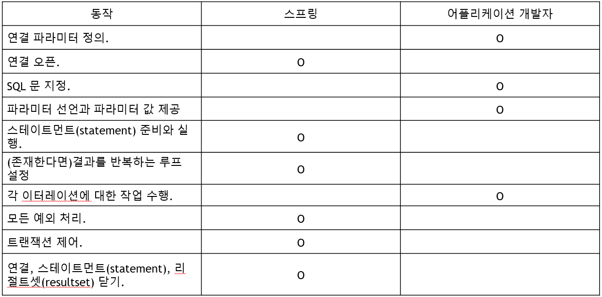

# 37. Spring JDBC

#### [기존 JDBC의 문제점]

----

: 반복되는 개발 요소 존재

: 이런 JDBC의 모든 저수준 세부사항(**반복적 요소)들을 스프링 프레임워크가 처리**

: 개발자는 필요한 부분만 개발하면 된다.

<br>

#### [스프링에서 해주는 것들과 개발자가 해야하는 것]

----



- 연결 파라미터 정의 : 어떤 DB에 접속할지등에 대한 정보들 입력
- SQL문 지정 
- 파라미터 선언과 파라미터 값 제공
- 각 이터레이션에 대한 작업 수행

<br>

#### [Spring JDBC가 가지고 있는 패키지들]

----

: 스프링 프레인 JDBC, 추상화 프레임워크들이 다음과 같은 패키지로 구성

- **org.springframework.jdbc.core** 패키지

  : JDBC 템플릿 클래스, JDBC 템플릿의 다양한 콜백 인터페이스 포함

  : 그 외에도 여러 관련 클래스 포함

- **org.springframework.jdbc.datasource** 패키지

  : 데이터 소스의 접근을 쉽게하는 유틸리키 클래스

  : javaEE 컨테이너

  : 외부에 수정되지 않고 운영되는 JDBC 코드

  : 테스트에서 사용 가능한 여러가지 간단한 데이터 소스 구현체 들 포함

- **org.springframework.jdbc.object** 패키지

  : RDBMS의 조회, 갱신, 저장 프로시저를 스레드 세이프하고 재사용 가능 객체로 나타내는 클래스 포함

- **org.springframework.jdbc.support** 패키지

  : SQL Exception 변환 기능과 약간의 유틸리티 클래스를 제공

<br>

#### [JDBCTemplate]

----

: **org.springframework.jdbc.core** 패키지에서 가장 중요한 클래스

: **리소스 생성, 해지를 처리**해서 연결 닫는 것을 잊어 발생하는 문제 회피하게 해준다.

: **스태이먼트(Statement) 생성, 실행 처리**

: **SQL 조회, 업데이트, 저장 프로시저 호출, ResulSet 반복호출** 등 실행

: JDBC 예외 발생시, org.springframework.dao패키지에 정의되어있는 일반적 예외로 변환

<br>

#### [JDBCTemplate 사용 예제]

----

: 아래와 같이 기존에 여러줄에 거쳐 적어야 했던 JDBC 처리문들을 간단하게 적어서 처리할 수 있다.

1. **JdbcTemplate select**

   - **예제1 - 열의 수 구하기**

     : 지정한 테이블에 몇건의 데이터가 있는지 알아낼 수 있는 쿼리

     ```java
     int rowCount = this.jdbcTemplate.queryForInt("select count(*) from t_actor")
     ```

   - **예제2 - 변수 바인딩 사용하기**

     : **"?"** 이용해 수행될때마다 달라지는 first_name 값 처리

     ```java
     int countOfActorsNamedJoe = 
         this.jdbcTemplate.queryForInt(
         "select count(*) from t_actor where first_name = ?", 
         "Joe"
     ); 
     // 두번째 파라미터인 값 "joe"를 이용해 앞의 ? 값 채워서 실행 가능
     ```

     

   - **예제3 - String 값으로 결과 받기**

     ```java
     String lastName = 
         this.jdbcTemplate.queryForObject(
         "select last_name from t_actor where id = ?", 
         new Object[]{1212L}, String.class
     ); 
     
     // queryForObject의 3번째 파라미터로 받아들인 값에 return 받을 타입 적어주면 원하는 타입으로 리턴 받을 수 있다.
     ```

     

   - **예제4 - 한 건(행) 조회하기** 

     - **RowMapper** 객체 

       : 한 행에는 여러 칼럼 있고, 이 칼럼들을 원하는 객체에 매핑해줄때 사용 객체

     ```java
     Actor actor = this.jdbcTemplate.queryForObject(
       "select first_name, last_name from t_actor where id = ?",
       new Object[]{1212L}, new RowMapper<Actor>() {
         public Actor mapRow(ResultSet rs, int rowNum) throws SQLException {
           Actor actor = new Actor();
           actor.setFirstName(rs.getString("first_name"));
           actor.setLastName(rs.getString("last_name"));
           return actor;
         }
       });
     
     // RowMapper 상속받은 이름 없는 객체를 사용해 **mapRow()**라는 메서드 오버라이딩.
     // 한 건의 결과가 ResultSet에 담겨있음
     // 해당 ResultSet의 값을 Action에 담아 리턴하고 있다.
     ```

     <br>

   - **예제5 - 여러 건 조회하기** 

     : query() 메서드 사용

     ```java
     List<Actor> actors = this.jdbcTemplate.query(
       "select first_name, last_name from t_actor",
       new RowMapper<Actor>() {
         public Actor mapRow(ResultSet rs, int rowNum) throws SQLException {
           Actor actor = new Actor();
           actor.setFirstName(rs.getString("first_name"));
           actor.setLastName(rs.getString("last_name"));
           return actor;
         }
       });
     ```

     <br>

   - **예제6 - 중복 코드 제거** 

     : 예제 4(한건 select)와 예제 5(여러건 select) 둘다 동일한 RowMapper 사용

     : **해당 부분을 별도의 메서드로 추출해서 코드의 중복 방지 가능**

     ```java
     public List<Actor> findAllActors() {
       return this.jdbcTemplate.query( "select first_name, last_name from t_actor", new ActorMapper());
     }
     
     private static final class ActorMapper implements RowMapper<Actor> {
       public Actor mapRow(ResultSet rs, int rowNum) throws SQLException {
         Actor actor = new Actor();
         actor.setFirstName(rs.getString("first_name"));
         actor.setLastName(rs.getString("last_name"));
         return actor;
       }
     }
     ```

     <br>

2.  **JdbcTemplate insert**

   : INSERT, UPDATE, DELETE 모두 **update() 메서드**를 이용

   : ? 개수만큼 SQL 문 뒤에 ?에 들어갈 값 넣어준다.

   <br>

   - **예제1 - INSERT 하기**

     ```java
     this.jdbcTemplate.update(
         "insert into t_actor (first_name, last_name) values (?, ?)",  
         "Leonor", "Watling"
     );
     ```

     <br>

   - **예제2 - UPDATE 하기**

     ```java
     this.jdbcTemplate.update(
         "update t_actor set = ? where id = ?",  
         "Banjo", 5276L
     );
     ```

     <br>

   - **예제3 - DELETE 하기**

     ```java
     this.jdbcTemplate.update(
     "delete from actor where id = ?", 
     Long.valueOf(actorId)
     );
     ```

<br>

#### [JDBCTemplate외의 접근 방법]

----

: **JDBC 템플릿만 이용해도 기존 JDBC 프로그래밍보다 훨씬 간단하게 구현 가능**

: 추가로 아래 클래스들 이용하면 좀더 편하게 프로그래밍 가능

- **NamedParameterJdbcTemplate**

  : ? 대신 이름 사용해 바인딩 할 수 있게끔 해준다. (? 많으면 혼동될수도 있으니.. )

- SimpleJdbcTemplate

  : JdbcTemplate과 NamedParameterJdbcTemplate 합쳐 놓은 템플릿 클래스

  : 두개에서 가장 빈번하게 사용되는 작업을 합쳐놓은 객체

  : 이제는 JdbcTemplate에서 NamedParameterJdbcTemplate 모든 기능 제공해 삭제 예정

- SimpleJdbcInsert

  : 좀더 쉽게 insert 작업 수행을 도움

