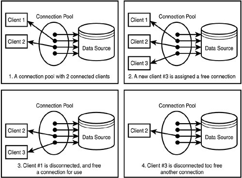
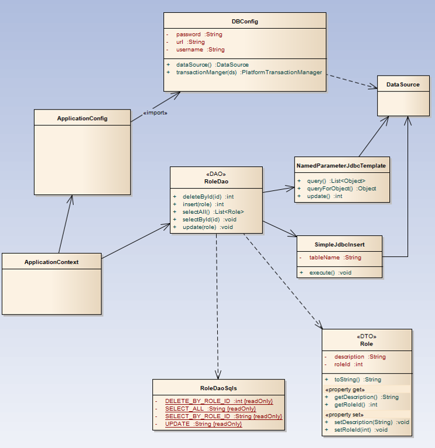

# 38. Spring JDBC 예제

#### [개발전 알아야 되는 개념들]

---

1. **DTO**

   : Data Transfer Object의 약자

   : **계층(컨트롤러 뷰, 비지니스 계층, 퍼시스턴스 계층 의미)간 데이터 교환을 위한 자바빈즈**

   : 순수한 **데이터 객체**

   - DTO 예제

     : **필드와 getter, setter를 가진다**

     : 추가적으로 **toString(). equals(), hashCode()** 등의 Object 메소드 오버라이딩 가능

     ```java
     public class ActorDTO {
     	private Long id;
     	private String firstName;
     	private String lastName;
     	
     	public String getFirstName() {
     		return this.firstName;
     	}
     	public String getLastName() {
     		return this,lastName;
     	}
     	public Long getId() { ...
     	...
     }
     ```

   <br>

2. **DAO**

   :  Data Access Object의 약자

   : **데이터를 조회하거나 조작하는 기능을 전담하도록 만든 객체**

   : 보통 DB 조작 기능 전담 목적으로 만들어진다.

   <br>

3. **ConnectionPool**

   

   : 비싼 DB 연결 비용

   : 커넥션풀은 **미리 커넥션을 여러개 맺어 준다**

   : 커넥션 필요시 커넥션 풀에게 **빌려서 사용후 반납**

   : 반납 안하면 느려지거나 오류발생.

   <br>

4. **DataSource**

   : **커넥션 풀을 관리하는 목적**으로 사용되는 객체

   : 이를 통해 커넥션 얻어오고 반납하는 등의 작업을 수행

   <br>

#### [Spring JDBC를 이용한 DAO 개발]

---

- **Spring JDBC를 이용한 DAO 패턴 구조**

  

  - **ApplicationContext**

    : Spring 컨테이너. **설정 파일**. **ApplicationConfig 라는 클래스를 읽어들임**.

    : **DB Config 클래스를 import**

    <br>

  - **ApplicationConfig**

    : 컴포넌트 스캔 어노테이션이 DAO를 찾도록 설정

    : 이를 통해 **찾은 모든 DAO 클래스는 Spring 컨테이너(ApplicationContext)가 관리**힌다.

    <br>

  - **DBConfig**

    : dataSource와 transactionManager 객체를 생성

    <br>

  - **RoleDAO(DAO)**

    : 필드로 NamedParameterJdbcTemplate과 SimpleJdbcInsert를 가짐

    : 이 두 객체는 모두 **DataSource를 필요**로 한다. (DB 연결을 위해 내부적으로 DataSource를 사용)

    : **두 객체모두 SQL 실행 편리하게 하도록 Spring JDBC에서 제공하는 객체**

    : 이 두객체를 여기의 생성자에서 초기화하고 이를 이용해 RoleDao 메서드 구현

    <br>

  - **RoleDaoSqls**

    : **SQL 문을 상수로써 정의**해둠 (이후 SQL 변경되도 변경에 용이하게끔)

    <br>

  - **Role(DTO)**

    : **한건의 Role 정보를 저장, 전달 목적**으로 사용

<br>

#### [Spring JDBC를 이용한 DAO 개발 실전]

----

1. **maven 프로젝트 생성**

   : org,,, / maven-architect-quickstart 

   : 그룹 Id - kr.or.connect

   : 프로젝트명 - daoexam

   <br>

2. **pom.xml 에 라이브러리 추가**

   - Spring 사용 위한 spring-context 추가

     ```xml
     <!-- Spring -->
         <dependency>
         	<groupId>org.springframework</groupId>
         	<artifactId>spring-context</artifactId>
         	<version>${spring.version}</version>
         </dependency>
     ```

   - Spring JDBC 사용위한 spring-jdbc와 spring-tx 추가

     ```
     <!-- Spring JDBC-->
         <dependency>
         	<groupId>org.springframework</groupId>
         	<artifactId>spring-jdbc</artifactId>
         	<version>${spring.version}</version>
         </dependency>
         
         <dependency>
         	<groupId>org.springframework</groupId>
         	<artifactId>spring-tx</artifactId>
         	<version>${spring.version}</version>
         </dependency>
     ```

   - ${spring.version} 사용위한 프로퍼티 정보 추가

     ```
     <properties>
     	...
     	<spring.version>4.3.5.RELEASE</spring.version>
     </properties>
     ```

   - mysql 데이터베이스 사용위한 드라이버로 mysql-connector-java 추가

     ```
     <!-- mysql -->
         <dependency>
         	<groupId>mysql</groupId>
         	<artifactId>mysql-connector-java</artifactId>
         	<version>5.1.45</version>
         </dependency>
     ```

   - DataSource 사용위해 Apache에서 제공하는 commons-dbcp2 추가

     ```
     <!-- basic data source -->
     	<dependency>
     		<groupId>org.apache.commons</groupId>
     		<artifactId>commons-dbcp2</artifactId>
     		<version>2.1.1</version>
     	</dependency>
     ```

   <br>

3. **라이브러리 pom 작성후 Maven 프로젝트 업데이트**

   : 프로젝트 우클릭 - Maven - Update Project

   <br>

4. **앞서 보았던 Spring JDBC이용한 DAO 구조에서 만들어야하는 파일들 생성**

   - 패키지 생성

     : name - kr.or.connect.daoexam.config 인 설정파일용 패키지 생성

   - ApplicationConfig 클래스 생성

     : Spring이 만들어주는 ApplicationContext에게 어떤 설정들을 읽어들여 공장 만들지 알려주는 역할

     ```java
     package kr.or.connect.daoexam.config;
     
     import org.springframework.context.annotation.Configuration;
     import org.springframework.context.annotation.Import;
     
     @Configuration  // config 파일임을 알려주는 어노테이션
     @Import({DBConfig.class})       // 어노테이션 사용시 설정 파일 여러개로 나눠서 작성 가능(여기선 DBConfig 라는 파일에 데이터베이스 연결에 관련된 설정을 분리)
     public class ApplicationConfig {
     }
     ```

   - DBConfig 클래스 생성

     : 데이터베이스 설정만 따로 담고 있는 Config 클래스 (위에서 분리함)

     ```java
     package kr.or.connect.daoexam.config;
     
     import javax.sql.DataSource;
     import org.apache.commons.dbcp2.BasicDataSource;
     import org.springframework.context.annotation.Bean;
     import org.springframework.context.annotation.Configuration;
     import org.springframework.transaction.annotation.EnableTransactionManagement;
     
     @Configuration  // config 파일임을 알려주는 어노테이션
     @EnableTransactionManagement  // 다음강에서 다룸. 그냥 이 어노테이션은 트랜잭션때문에 필요하다는 것까지만 ㅇㅇ
     
     public class DBConfig {
     	// DB 연결위해 필요한 정보
     	private String driverClassName = "com.mysql.jdbc.Driver";
         private String url = "jdbc:mysql://localhost:3306/connectdb?useUnicode=true&characterEncoding=utf8";
     
         private String username = "connectuser";
         private String password = "connect123!@#";
         
         // DB에 접속하는 부분을 얻어내기위한 DataSource 생성해주는 클래스
         @Bean
         public DataSource dataSource() {  // 커넥션 관리해야하기 때문에 JDBC 드라이버, url, username, password등의 정보 필요
         	BasicDataSource dataSource = new BasicDataSource();
         	dataSource.setDriverClassName(driverClassName);
         	dataSource.setUrl(url);
         	dataSource.setUsername(username);
         	dataSource.setPassword(password);
         	return dataSource;
         }
     }
     ```

   - 작성후 DB 접속 여부 테스트 코드 (추가)

     ```java
     package kr.or.connect.daoexam.main;
     
     import java.sql.Connection;
     import javax.sql.DataSource;
     
     import org.springframework.context.ApplicationContext;
     import org.springframework.context.annotation.AnnotationConfigApplicationContext;
     
     import kr.or.connect.daoexam.config.ApplicationConfig;
     
     public class DataSourceTest { // DBConfig에서 DB 연결 이상 여부 확인 위한 클래스
     	public static void main(String[] args) {
     		// ApplicationConfig에서 어노테이션 정보 읽어오기 (저 Config 파일에선 DBConfig 파일 impot 했음)
     		ApplicationContext ac = new AnnotationConfigApplicationContext(ApplicationConfig.class);
     		DataSource ds = ac.getBean(DataSource.class);
     		Connection conn = null;
     		try {
     			conn = ds.getConnection();
     			if(conn != null) {
     				System.out.println("접속 성공");
     			}
     		} catch (Exception e) {
     			e.printStackTrace();
     		} finally {
     			if(conn != null) {
     				try {
     					conn.close();
     				} catch (Exception e) {
     					e.printStackTrace();
     				}
     			}
     		}
     	}
     
     }
     ```

   <br>

5. **select 하기위한 클래스 작성**

   : NamedParameterJdbcTemplate 클래스와 SimpleJdbcInsert는 Spring JDBC에서 제공

   <br>

   - DTO 클래스를 위한 패키지 따로 생성

     : kr.or.connect.daoexam.dto 패키지 생성

     <br>

   - **Role(DTO) 클래스 생성**

     : 데이터 전달시 사용할 목적 (getter, setter 메서드 필요)

     ```java
     // dto package - Role.class
     package kr.or.connect.daoexam.dto;
     
     public class Role {
     	private int roleId;
     	private String description;
     	
     	// getter and setter
     	public int getRoleId() {
     		return roleId;
     	}
     	
     	public void setRoleId(int roleID) {
     		this.roleId = roleID;
     	}
     	public String getDescription() {
     		return description;
     	}
     	public void setDescription(String description) {
     		this.description = description;
     	}
     	
     	@Override
     	public String toString() {
     		return "Role [roleID=" + roleId + ", description=" + description + "]";
     	}
     	
     }
     ```

     : **source 탭** 이용해 자동으로 getter, setter 메서드 자동 생성하고 toSring()도 자동 생성가능

     <br>

   - DAO 클래스를 위한 dao 패키지 생성

     : kr.or.connect.daoexam.dao 패키지 생성

     <br>

   - **RoleDaoSqls 클래스 생성**

     : 쿼리 문 가지고 있는 클래스

     ```java
     // dao 패키지 - RoleDaoSqls 클래스
     package kr.or.connect.daoexam.dao;
     
     // 내부에 사용하고 자하는 쿼리를 상수형태로 삽입
     public class RoleDaoSqls {
     	// 전체 slect 문
     	public static final String SELECT_ALL =
     			"SELECT role_id, description FROM role order by role_id";
     }
     ```

     : **모든 상수는 글자를 대문자로 **쓰는 것이 관례

     <br>

   - **RoleDao 클래스 생성(DAO)**

     : 데이터 엑세스 위한 오브젝트

     : **RoleDaoSqls에서 선언한 쿼리문을 가지고 데이터를 액세스 할수 있는 메서드 = DAO 오브젝트**

     ```java
     // dao 패키지 - RoleDao 클래스 생성
     package kr.or.connect.daoexam.dao;
     
     import java.util.Collections;
     import java.util.List;
     
     import javax.sql.DataSource;
     
     import org.springframework.jdbc.core.BeanPropertyRowMapper;
     import org.springframework.jdbc.core.RowMapper;
     import org.springframework.jdbc.core.namedparam.NamedParameterJdbcTemplate;
     import org.springframework.stereotype.Repository;
     
     import kr.or.connect.daoexam.dto.Role;
     // static import : 으로 선언한 객체의 변수를 클래스 이름 없이 바로 가져다 사용할수 있게 해줌
     import static kr.or.connect.daoexam.dao.RoleDaoSqls.*;
     
     // DAO 클래스는 저장소의 역할을 하기때문에 아래와 같은 어노테이션 붙임 - Bean 등록위한
     @Repository
     public class RoleDao {
     	// Spring JDBC에서 제공하는 NamedParameterJdbcTemplate을 사용하기 위한 코드 (다음 ====까지)
     	// 해당 클래스는 query(), queryForObject(), update() 와같은 메서드 제공
     	
     	 // 그냥 JdbcTemplate 사용하면 바인딩시 ? 사용하는데 이는 구분이 어려워 NamedParametJdbcTemplate 사용해 바인딩하거나 결과값 가져옴
     	private NamedParameterJdbcTemplate jdbc; 
     	// BeanPropertyRowMapper는 DBMS와 Java에서 사용하는 서로 다른 이름 규칙 role_id, roleID 등과같은 이름 규칙 맞춰주는 기능 보유
     	private RowMapper<Role> rowMapper = BeanPropertyRowMapper.newInstance(Role.class);
     	
     	public RoleDao(DataSource dataSource) { //DBConfig에서 선언했던 dataSource를 받아들여 객체 생성
     		this.jdbc = new NamedParameterJdbcTemplate(dataSource);
     	}
     	
     	// ====
     	
     	// selectAll 해서 가져오는 부분 수행
     	public List<Role> selectAll() {
     		//query메서드(실행할 sql문 - static import해서 바로 사용, 비어있는 맵객체, select 한건한건의 결과를 DTO에 저장 목적)
     		// 3번째 파라미터의 BeanPropertyRowMapper를 통해 column의 값을 자동으로 DTO에 담음
     		// query() 메서드는 결과 여러 건일때 내부적으로 반복해 DTO 생성, 반복해 List에 저장후 List 반환
     		return jdbc.query(SELECT_ALL, Collections.<String, Object>emptyMap(), rowMapper);
     	}
     }
     ```

     <br>

   - RoleDao에서 Bean을 등록하는 방법으로 어노테이션 이용했기에 ApplcationConfig 수정

     : ComponentScan으로 읽어낼꺼라는 설정 추가 (이러해야 설정 파일 읽어낼때 약속된 어노테이션 붙어있는 객체들 찾아내서 일을 진행 )

     ```java
     // ApplicationConfig 파일 수정
     package kr.or.connect.daoexam.config;
     
     import org.springframework.context.annotation.ComponentScan;
     import org.springframework.context.annotation.Configuration;
     import org.springframework.context.annotation.Import;
     
     @Configuration  
     // 베이스 패키지 지정해야 사용 가능
     @ComponentScan(basePackages = { "kr.or.connect.daoexam.dao" }) 
     @Import({DBConfig.class})     
     public class ApplicationConfig {
     }
     ```

     : 붙이면 자동으로 RoleDao에 Repository 붙은 클래스를 Bean으로 등록해준것과 동일한 역할

     <br>

   - 생성한 DAO, DTO 동작 여부 테스트 코드 작성

     ```java
     // main 패키지 - SelectAllTest 클래스
     package kr.or.connect.daoexam.main;
     
     import java.util.List;
     
     import org.springframework.context.ApplicationContext;
     import org.springframework.context.annotation.AnnotationConfigApplicationContext;
     
     import kr.or.connect.daoexam.config.ApplicationConfig;
     import kr.or.connect.daoexam.dao.RoleDao;
     import kr.or.connect.daoexam.dto.Role;
     
     public class SelectAllTest {
     
     	public static void main(String[] args) {
     		ApplicationContext ac = new AnnotationConfigApplicationContext(ApplicationConfig.class); 
     		
     		// getBean을 통해 RoleDao 가져옴
     		RoleDao roleDao =ac.getBean(RoleDao.class);
     
     		List<Role> list = roleDao.selectAll();
     		
     		for(Role role: list) {
     			System.out.println(role);
     		}
     	}
     }
     ```

     : 실행해 가져온 database 값과 다르면 DTO 클래스파일 확인해보기

     : mysql에서 column명 role_id면 DTO에선 roleID로 선언해야함.

   <br>

6. **insert문, update문 구현하기**

   - RoleDaoSqls에 쿼리문 추가

     : **insert문은 SimpleJdbcInsert라는 것 이용할꺼기 때문에 따로 추가 X**

     ```java
     public static final String UPDATE = 
         "UPDATE role SET description = :description WHERE ROLE_ID = :roleId";
     ```

     <br>

   - RoleDao에 메서드 추가 (insert문, update문)

     ```java
     ...
     	// insert문을 위한 SimpleJdbcInsert를 선언
     	private SimpleJdbcInsert insertAction;
     	
     	public RoleDao(DataSource dataSource) { 
     		this.jdbc = new NamedParameterJdbcTemplate(dataSource);
             
             // insertAction 객체 생성 - 어떤 테이블에 넣을껀지 테이블이름만 알려주면된다.
     		this.insertAction = new SimpleJdbcInsert(dataSource)
                     .withTableName("role");
     	}
     ...
     ```

     ```java
     // 메서드 추가
     	public int insert(Role role) {
     		SqlParameterSource params = new BeanPropertySqlParameterSource(role);
     		return insertAction.execute(params);
     	}
     
     	public int update(Role role) {
     		SqlParameterSource params = new BeanPropertySqlParameterSource(role);
     		return jdbc.update(UPDATE, params);
     	}
     ```

     <br>

   - 이를 테스트 하기위한 JDBCTest 클래스 파일 생성

     ```java
     package kr.or.connect.daoexam.main;
     
     import org.springframework.context.ApplicationContext;
     import org.springframework.context.annotation.AnnotationConfigApplicationContext;
     
     import kr.or.connect.daoexam.config.ApplicationConfig;
     import kr.or.connect.daoexam.dao.RoleDao;
     import kr.or.connect.daoexam.dto.Role;
     
     public class JdbcTest {
     
     	public static void main(String[] args) {
     		ApplicationContext ac = new AnnotationConfigApplicationContext(ApplicationConfig.class);
     
     		RoleDao roleDao = ac.getBean(RoleDao.class);
     		
     		Role role = new Role();
     		role.setRoleId(201);
     		role.setDescription("PROGRAMMER");
     		
     		int count = roleDao.insert(role);
     		System.out.println(count + "건 입력하였습니다.");
     			
     		count = roleDao.update(role);
     		System.out.println(count +  " 건 수정하였습니다.");
     	}
     }
     ```

   <br>

1. **1건 select와 삭제 구현하기**

   : RoleDao에 1건 select를 위한 selectById(id)와 delete를 위한 deleteById(id)를 구현하면된다.

   <br>

   - **RoleDaoSqls에 쿼리문 추가**

     ```java
     public static final String SELECT_BY_ROLE_ID = 
         "SELECT role_id, description FROM role WHERE role_id = :roleID";
     public static final String DELETE_BY_ROLE_ID = 
         "DELETE FROM role WHERE role_id = :roleId";
     ```

     : 값 앞에 ':' 붙는건 바인딩 할 값임을 알려주는 역할

     <br>

   - **RoleDao에 메서드 추가**

     : selectById, deleteByID 메서드 추가

     ```java
     // 삭제문
     	public int deleteById(Integer id) {
     		// 두번째 파라미터로 드어올 Map 객체
     		// sql 파라미터 소스가 제공하고 있는 params 부분이 객체에 들어있는 것을 알아서 DB column문을 맞춰서 Map으로 바꿔주는 역할
     		// 위와같이 sqlParameterSource 써서 들어가는 ? 값 하나인데 또 굳이 객체로 만들기엔 결과가 단일하기 때문에 이방법 사용
     		Map<String, ?> params = Collections.singletonMap("roleId", id);
     		return jdbc.update(DELETE_BY_ROLE_ID, params);
     	}
     ```

     ```java
     // id로 1건 select문
     public Role selectById(Integer id) {
     	try {
     		Map<String,?>params = Collections.singletonMap("roleId", id);
     		return jdbc.queryForObject(SELECT_BY_ROLE_ID, params, rowMapper);
     	} catch(EmptyResultDataAccessException e) {
     		return null;
     	}
     }
     ```

     <br>

   - JDBCTest.java에 추가

     ```java
     Role resultRole = roleDao.selectById(201);
     System.out.println(resultRole);
     		
     int deleteCount = roleDao.deleteById(500);
     System.out.println(deleteCount + "건 삭제하였습니다.");
     	
     Role resultRole2 = roleDao.selectById(500);
     System.out.println(resultRole2);
     ```

     
