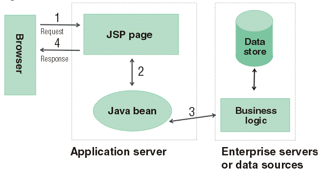
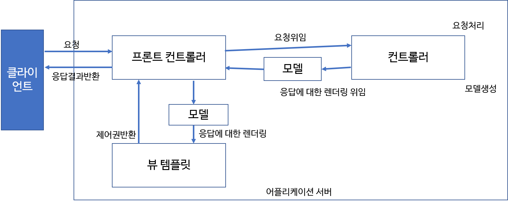
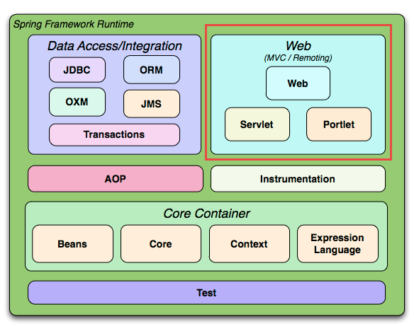

# 39. Spring MVC

#### [MVC]

---

: Model-View_Controller의 약자

: 처음엔 데스크톱 어플리케이션용으로 고안되었으나 웹 어플리케이션 등에서도 사용

 

- **Model**

  : 뷰가 렌더링하는데 필요한 데이터. ex) 사용자가 요청한 상품 목록, 주문 내역 등

- **View**

  : 실제로 보이는 부분. 모델을 사용해 랜더링. JSP, JSF, PDF, XML 등으로 결과를 표현

- **Controller**

  : 사용자의 액션에 응답하는 컴포넌트

  : Model을 업데이트하고 다른 액션 수행

 

#### [자바 웹 프로그래밍에서의 MVC Model 형태]

----

: 두가지 형태로 변형됨.

 

1. **MVC Model 1 아키텍처**

   

   : 브라우저가 요청을 하게 되면 해당 요청을 **JSP**가 받는다

   : 그래서 **요청만큼 JSP 페이지 존재**해야함.

   : 위의 JSP는 **Java bean**을 이용해 데이터페이스를 사용

   : Java bean은 앞에서 본 JDBC로 작성했던 Role Dao 이런 클래스를 의미.

   : 이 방법의 문제점은 **JSP 자체에 Java 코드와 HTML 코드 섞여있기에 유지보수에 어려움 존재**

   : 이를 개선한게 Model 2 아키텍처.

    

2. **MVC Model 2 아키텍처**

3. 

   : 요청 자체를 **서블릿(요청과 데이터를 처리하는 컨트롤러의 역할)**이 받게한다.

   : 서블릿이 Java bean을 이용해서 DB에서 데이터 꺼내온다.

   : 그 결과를 **JSP(모델 결과보여주는 View의 역할)**를 통해 화면에 보여주는 모델

   : 로직과 뷰 분리 형태.

    

4. **MVC Model 2 보다 발전 형태**

   

   : 클라이언트가 보내는 모든 요청을 **프론터 컨트롤러**라는 **딱 하나만 존재하는 서블릿** 클래스가 받는다 

   : 이 프론트 컨트롤러는 **요청만 받고 실제 일을 처리하지 않고 컨트롤러 클래스에게 위임**

   : 컨트롤러 클래스(핸들러 클래스)는 여러개 존재

   : 이방법을 통해 **관련된 URL을 하나의 클래스에서 다 처리 가능**

   : 컨트롤러 클래스는 Java bean등 이용해 결과 만들어 내고 

   **만들어진 결과를 모델에 담아 프론트 컨트롤러에 전달하면 프론트 컨트롤러는 알맞는 뷰 템플릿에 전달**

    

#### [Spring Web Module]

---

: 위에서 말한 **Model 2의 발전된 형태**가 **Spring 프레임워크** 모듈중에 하나인 **Web 모듈**에 구현되어 있다.

: 그리고 이러한 Web 모듈을 **Spring MVC**라고 한다.

 

#### [Spring MVC의 기본 동작 흐름]

----

- **색깔에 따른 역할 분할**

  - Database를 제외한 파란색 부분**: Spring MVC에서 제공하는 부분
  - **보라색 부분**: 개발자가 만들어야하는 부분
  - **녹색 부분**: Spring이 제공하는 부분도 있고 개발자가 만들어야 하는 부분도 같이 존재

   

- **순서 따라가기**

  1. **클라이언트가 요청**보내면 보낸 **모든 요청을 Dispatcher Servlet이 받는다**

  2. **Dispatcher Serlvet**은 **요청을 처리해줄 컨트롤러와 메서드가 무엇인지 Handler Mapping에게 물어봄**

     : **어떤 요청에 어떤 컨트롤러가 동작할지를 xml 파일이나 java 파일에 어노테이션으로 설정**

     : 이런 정보들을 Spring으로 만들어진 웹 어플리케이션으로 실행시 Handler Mapping 객체들이 생성되며 관리

  3. Dispatche Servlet이 요청을 처리해줄 컨트롤러와 메서드를 알아낸뒤,**Handler Adapter**에게 실행 요청

  4. 이때 **결정된 컨트롤러와 해당 메서드가 실행**

  5. 그 **결과를 모델에 받아서 Dispatcher Serlvet에 전달**

     : 이때 Dispatche Servlet은  **컨트롤러가 리턴한 view name**을 알아옴

  6. 컨트롤러가 리턴한 view name을 가지고 적절한 **View Resolver**를 통해서 어떤 View인지 정보 정확히 알려줌

  7. **알려준 View로 응답**

 

#### [DispatcheServlet]

----

: **프론트 컨트롤러(대표번호의 개념)**

: **클라이언트의 모든 요청을 받은후 이를 처리할 핸들러에게 넘기고, 핸들러가 처리한 결과를 받아 사용자에게 응답 결과 보여준다**

: 보통 한개만 선언해 사용

: 여러 컴포넌트들을 이용해 작업

 

#### [DispatcherServlet의 내부 동작 흐름]

-----

: 간단히만 사용할땐 여기까진..

: 그냥 내부적으로 실행되는 과정정도로만.

: 이하 생략.