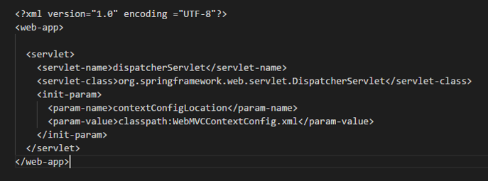
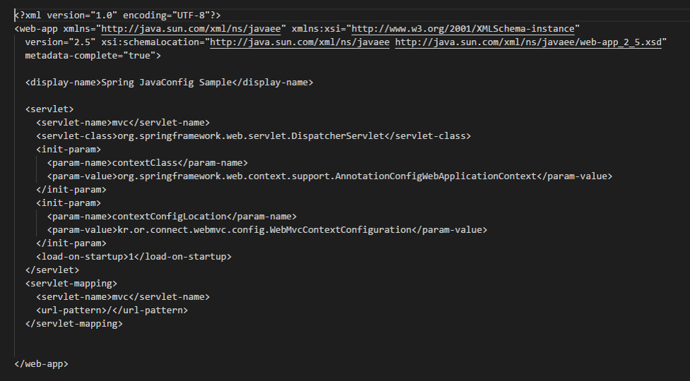
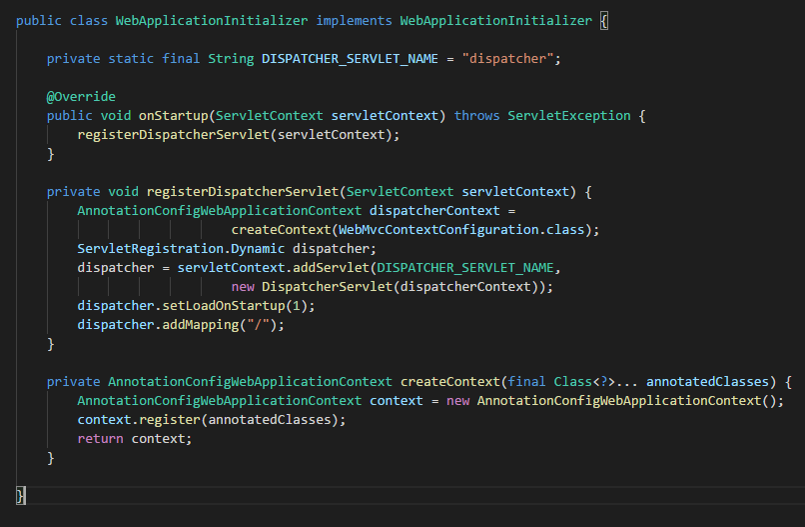

# 40. Spring MVC 예제

#### [프로젝트 설정(1~6)]

#### [Spring MVC를 사용할수 있도록 설정 (7~10)]

----

1. **DispatcherServlet을 FrontController로 설정**

   : 총 3가지 방법이 존재

   ```
   1) web.xml 파일에 설정 
   2) 서블릿 3.0 이상에서 web.xml 파일 대신 javax.servlet.ServletContainerInitializer사용가능
   3) Spring에서 제공 org.springframework.web.WebApplicationInitializer 인터페이스 구현 사용
   ```

   - **1) web.xml에서 DispatcherServlet 설정하기**

     ```
     <servlet-class> 
     : 실제로 실행시킬 클래스명을 의미하고 여기서 Spring이 제공하는 DispatcherServlet 이용
     
     <init-param>
     : 내가 어떤일을 할지 작성하는 부분
     ```

     - xml spring 설정 읽어들이도록 DispatcherServlet 설정

       

     - **Java config spring 설정 읽어들이도록 DispatcherServlet 설정 (이방법 사용 예정)**

       

       : url-pattern에 적힌 주소가 요청이 들어오면 실제 servlet-name과 같은 name으로 매핑되어있는 servlet-class가 실행.

       : **여기서 url-pattern '/' 라고 적혀있는데 이것은 모든 요청을 DispatcherServlet이 받도록 설정.**

     <br>

   - **3) WebApplicationInitializer를 구현해서 설정하기**

     : 처음 웹 어플리케이션 구동에 딜레이 존재 단점 존재.

     : 구현하고 있는 객체에서 아래와 같이 선언해서 사용 (수업에서 안다룸)

     

   <br>

2. **Spring MVC 설정**

   : **DispatcherServlet이 읽어들여야 될 설정 별도 작업.** 

   (위에서 이 프로젝트에선 이런 설정을 자바 config로 한다고 설정 1-2)

   : **DispatcherServlet이 이 설정 읽어들여 내부적으로 Spring 컨테이너인 ApplicationContext를 생성**

   ```java
   // kr.or.connect.webmvc.config.WebMvcContextConfiquration
   @Configuration
   @EnableWebMvc
   @ComponentScan(basePackages = {"kr.or.connect.webmvc.controller"})
   public class WebMvcContextConfiguration extends WebMvcConfigurerAdapter {
   ...
   }
   ```

   - **@Configuration**

     : 자바 컨피그 파일임을 알려주는 어노테이션

   - **@EnableWebMvc**

     : 웹에 필요한 빈들을 대부분 자동으로 설정해주는 어노테이션

     ```
     - DispatcherServlet의 RequestMappingHandlerMapping, RequestMappingHandlerAdapter,   
       ExceptionHandlerExceptionResolver, MessageConverter 등 
       Web에 필요한 빈들을 대부분 자동 설정
       
     - 만약 자바 config (1-2방법)이아닌 xml 파일로 설정(1-1 방법)했으면  
       <mvc:annotation-driven> 태그가 대신 이 역할했음 (여기선 사용 X)
       
     - 기본 설정 외 설정 필요시 WebMvcConfiguererAdapter 상속 받아 Java config class 작성후, 필요한 메소드 오버라이딩.  
     
     ```

   - **@ComponentScan**

     : 사용시 Controller, Service, Repository, Component 어노테이션이 붙은 클래스를 찾아 스프링 컨테이너가 관리하게 된다

   - **WebMvcConfigurerAdapter 클래스**

     : org.springframework.web.servlet.config.annotation.WebMvcConfigurerAdapter

     : @EnableWebMvc 이용하면 기본적인 설정이 모두 자동으로 되지만, 기본 설정외 설정 필요시 해당 클래스 상속 받은후 메소드 오버라이딩 하여 사용

   <br>

3. **Controller(Handler) 클래스 작성하기**

   : 위에는 모두 설정과 관련된 내용. 여기선 **사용자가 핸들러 클래스인 컨트롤러를 작성**

   : 실제로 요청을 처리하는 Controller 클래스

   - **@Controller 어노테이션을 클래스 위에 붙인다**

     : 붙이면 이것이 컨트롤러라는 정보를 ComponentScan이 읽어들여서 Spring 컨테이너가 관리하도록 함

   - **클래스나 메서드에 매핑을 위해 @RequestMapping 어노테이션을 사용**

     : 요청들어올때 어떤 URL로 들어온 요청인지 알아내서 실제로 처리해야하는 컨트롤러가 뭔지, 그 컨트롤러에서 구현하고 있는 메서드가 뭔지 그냥 알아낼수 없기때문에 **이 어노테이션을 이용해 이 메서드는 리스트라는 요청이 들어왔을때 수행할거라는 것과 같이 알려줘야 한다**.

     ```
     // RequestMapping
     : Http 요청과 이를 다루기 위한 Controller 의 메소드를 연결하는 어노테이션
     
     1) Http Method 와 연결하는 방법
     	// /users라는 URL로 요청 들어왓는데 요청에 대한 메서드가 POST 방식으로 들어오면 수행 의미
      - @RequestMapping(value="/users", method=RequestMethod.POST)
      	
      	// 아래와 같은 다양한거 4.3 버전 이후 사용 가능
      - From Spring 4.3 version (@GetMapping, @PostMapping, @PutMapping, @DeleteMapping, @PatchMapping)
      
      
     2) Http 특정 해더와 연결하는 방법
      - @RequestMapping(method = RequestMethod.GET, headers = "content-type=application/json")
      
     
     3) Http Parameter 와 연결하는 방법
      - @RequestMapping(method = RequestMethod.GET, params = "type=raw")
      
     
     4) Content-Type Header 와 연결하는 방법
      - @RequestMapping(method = RequestMethod.GET, consumes = "application/json")
      
     
     5) Accept Header 와 연결하는 방법
      - @RequestMapping(method = RequestMethod.GET, produces = "application/json")
     ```

     : 이와 같이 다양한 방법으로 RequestMapping 요청 가능을 Spring이 제공

     <br>

#### [컨트롤러 몇개 작성해 사용 방법 알아보기(11~)]

---

- Controller 작성 실습

1. 웹 브라우저에서 http://localhost:8080/mvcexam/plusform이라고 요청을 보내면 서버는 웹 브라우저에게 2개의 값을 입력받을 수 있는 입력 창과 버튼이 있는 화면을 출력
2. 웹 브라우저에게 2개의 값을 입력하고 버튼을 클릭하면 http:/locatlhost:8080/mvcexam/plus URL로 2개의 입력값이 POST 방식으로 서버에 전달. 서버는 2개의 값을 더한후, 그 결과 값을 JSP에게 request scrope으로 전달하여 출력한다.


<br>

#### [실습 과정]

----

1. **Maven 프로젝트 생성**

   : archetypes로 webapp 선택 / 그룹id : kr.or.connect / archi.. id : mvcexam

2. **프로젝트 내 자바폴더 생성**

   : src - main - java 폴더

3. **pom.xml에 필요한 부분 추가**

   - jdk 1.8 사용위한 plugins 추가

     ```xml
     <build>
         <finalName>mvcexam</finalName>
         <plugins>
         	<plugin>
         		<groupId>org.apache.maven.plugins</groupId>
         		<artifactId>maven-compiler-plugin</artifactId>
         		<version>3.6.1</version>
         		<configuration>
         			<source>1.8</source>
         			<target>1.8</target>
         		</configuration>
         	</plugin>	
         </plugins>
       </build>
     ```

   - jstl 라이브러리 추가

     ```xml
     <!--  jstl -->
         <dependency>
         	<groupId>jstl</groupId>
         	<artifactId>jstl</artifactId>
         	<version>1.2</version>
         </dependency>
     ```

   - jsp 라이브러리 추가

     ```xml
     <!--  jsp -->
         <dependency>
         	<groupId>javax.servlet.jsp</groupId>
         	<artifactId>javax.servlet.jsp-api</artifactId>
         	<version>2.3.1</version>
         	<scope>provided</scope>
         </dependency>
     ```

   - servlet 라이브러리 추가

     ```
     <!--  servlet -->
         <dependency>
         	<groupId>javax.servlet</groupId>
         	<artifactId>javax.servlet-api</artifactId>
         	<version>3.1.0</version>
         	<scope>provided</scope>
         </dependency>
     ```

   - spring 사용위한 spring-context 추가

     ```xml
     <!-- 스프링 -->
     <dependency>
     	<groupId>org.springframework</groupId>
     	<artifactId>spring-context</artifactId>
     	<version>${spring.version}</version>
     </dependency>
     ```

   - spring mvc 사용위한 webmvc 추가

     ```xml
     <!-- webmvc -->
     	<dependency>
     		<groupId>org.springframework</groupId>
     		<artifactId>spring-webmvc</artifactId>
     		<version>${spring.version}</version>
     	</dependency>
     ```

   - spring 버전 통일 위해 properties에 spring 버전정보 넣기

     ```xml
     <properties>
         <project.build.sourceEncoding>UTF-8</project.build.sourceEncoding>
         <spring.version>4.3.14.RELEASE</spring.version>
     </properties>
     ```

   <br>

4. **라이브러리 추가후 Update project **

   : 프로젝트 우클릭 - maven - update project

   <br>

5. **프로젝트 settings에서 facet 부분 지정하기**

   : 네비게이터 탭(안보이면 Window - show view.. ) - .setting - ....facet,,,, -

    "jst.web" 버전 2.3 => 3.1 로 수정해주기(서블릿 버전())

   <br>

6. **이클립스 재시작**

   : 재시작후 적용잘되었는지 확인위해 properties - Project Facet 부분에서 Dynamic web Model 3.1로 제대로 바뀌었는지 확인.

<br>

**======== 여기까지 프로젝트 생성 과정, 이제 Spring MVC를 사용할수 있도록 설정 ==============**

7. **설정에 대한 부분 모아둘 패키지 생성**

   : kr.or.connect.mvcexam.config

   : **이제 레이어드 아키텍처를 위한 config 파일들 작성**

   <br>

8. **DispatcherServlet이 읽어들이는 설정 파일 클래스 생성**

   : **WebMvcContextConfiguration 클래스 생성 (WebMvcConfiguerAdapter 상속)**

   : @EnableWebMvc 이용하면 기본적인 설정 자동이지만, 자동설정 외 설정을 위해 해당 클래스 상속

   : 붙어있어야될 어노테이션 3개 추가 (@Configuration, @EnableWebMvc, @ComponentScan)

   ```java
   package kr.or.connect.mvcexam.config;
   
   import org.springframework.context.annotation.Bean;
   import org.springframework.context.annotation.ComponentScan;
   import org.springframework.context.annotation.Configuration;
   import org.springframework.web.servlet.config.annotation.DefaultServletHandlerConfigurer;
   import org.springframework.web.servlet.config.annotation.EnableWebMvc;
   import org.springframework.web.servlet.config.annotation.ResourceHandlerRegistry;
   import org.springframework.web.servlet.config.annotation.ViewControllerRegistry;
   import org.springframework.web.servlet.config.annotation.WebMvcConfigurerAdapter;
   import org.springframework.web.servlet.view.InternalResourceViewResolver;
   
   // 이 클래스는 DispatcherServlet이 읽어들이는 설정 파일
   
   @Configuration
   @EnableWebMvc
   @ComponentScan(basePackages = { "kr.or.connect.mvcexam.controller" })  
   //basePackage 지정안해주면 어느 패키지부터 찾아야될지 몰라서 수행안될수도 있음
   public class WebMvcContextConfiguration extends WebMvcConfigurerAdapter {
   	
   	// web.xml파일에서 DispatcherServlet 설정할때 모든 URL에 대해 요청 들어오게끔 설정 ('/') 했음.
   	// 이때 컨트롤러의 URL이 매핑되어있는 요청만 들어오는게 아니라
   	// css, image, js 등등들의 요청도 받아들임.. 
   	// 이전엔 ..do 로 설정에 .do일경우만 요청 처리하게끔 했지만
   	// 요즘은 아래와 같은 방법 설정 (/js/css/img 등 으로 시작되는 URL 요청 들어오면 루트 디렉토리 밑에 각각의 디렉토리 만들어놓고
   	// 거기에다가 알맞게 사용. 이래는 각 타입에 들어오는 요청은 해당 위치에서 찾으라고 설정하는 것.
   	@Override
       public void addResourceHandlers(ResourceHandlerRegistry registry) {
           registry.addResourceHandler("/assets/**").addResourceLocations("classpath:/META-INF/resources/webjars/").setCachePeriod(31556926);
           registry.addResourceHandler("/css/**").addResourceLocations("/css/").setCachePeriod(31556926);
           registry.addResourceHandler("/img/**").addResourceLocations("/img/").setCachePeriod(31556926);
           registry.addResourceHandler("/js/**").addResourceLocations("/js/").setCachePeriod(31556926);
       }
    
       // default servlet handler를 사용하도록 한다
       @Override
       public void configureDefaultServletHandling(DefaultServletHandlerConfigurer configurer) {
           configurer.enable();
       }
      
       // 특정 URL에 대한 처리를 컨트롤러 클래스 작성하지 않고 매핑하게끔 해준다
       // 여기선 요청 자체가 "/"로 들어오는 건 main이라는 뷰를 보여주도록 처리
       @Override
       public void addViewControllers(final ViewControllerRegistry registry) {
       		System.out.println("addViewControllers가 호출됩니다. ");
           registry.addViewController("/").setViewName("main");
       }
       
       // resolver에게 prefix, suffix 저장.
       // 이름(ex. main) 앞에다는 "/WEB-INF/view/", 뒤에다는 ".jsp"를 붙여달라는 뜻
       // 즉 이 뷰는 WEB-INF/views/main.jsp라는 파일을 찾아준다.
       @Bean
       public InternalResourceViewResolver getInternalResourceViewResolver() {
           InternalResourceViewResolver resolver = new InternalResourceViewResolver();
           resolver.setPrefix("/WEB-INF/views/");
           resolver.setSuffix(".jsp");
           return resolver;
       }
   }
   ```

   <br>

9. **DispatcherServlet을 FrontController로 설정**

   : 위에서 작성한 **Java config spring 설정 읽어들이도록 DispatcherServlet 설정**(1-2방법) 방법 사

   용

   : 해당 코드를 web.xml에 추가 하면 Spring이 제공하는 DispatcherSevlet이 실제 FrontController의역할수행

   ```xml
   // src - webapp - WEB-INF - web.xml
   <?xml version="1.0" encoding="UTF-8"?>
   <web-app>
   
     <display-name>Spring JavaConfig Sample</display-name>
   
     <servlet>
       <servlet-name>mvc</servlet-name>
       <servlet-class>org.springframework.web.servlet.DispatcherServlet</servlet-class>
       <init-param>
         <param-name>contextClass</param-name>
         <param-value>org.springframework.web.context.support.AnnotationConfigWebApplicationContext</param-value>
       </init-param>
       <init-param>
         <param-name>contextConfigLocation</param-name>
         <param-value>kr.or.connect.mvcexam.config.WebMvcContextConfiguration</param-value>
       </init-param>
       <load-on-startup>1</load-on-startup>
     </servlet>
     <servlet-mapping>
       <servlet-name>mvc</servlet-name>
       <url-pattern>/</url-pattern>
     </servlet-mapping>
   
   </web-app>
   ```

   - url 패턴 '/' : 모든 요청 들어오면 servlet-name에 등록되있는 mvc와 이름이 같은 servlet-name의 servlet-class를 실행한다.
   - **init-param** : 위에서 지정된 servlet-class 실행하는건 springframework의 dispatcherservlet이 실행되는 뜻인데, **이때 앞서 작성한 dispatcherservlet 설정 파일 읽어들이게 설정**해주는 곳. (param-value 태그 이용해 지정)(패키지명 포함해 작성 필수)
   - **contextClass** : param이름. Ioc하면서 Bean 공장 있어야 한다 했는데, 여기서 AnnotationConfigWebApplicationContext 사용한다고 등록.

   <br>

10. **여기까지 설정된거 테스트**

    ```
    '/' 요청 오면 "main" 보여주는 거 설정 문제없는지 확인
    ```

    ```
    1) WEB-INF에 views 폴더 만들고 main.jsp 생성 (WebMvcContextConfiguration 클래스에서 오버라이드한 경로)
    
    2) main.jsp 작성
    <%@ page language="java" contentType="text/html; charset=EUC-KR"
        pageEncoding="EUC-KR"%>
    <!DOCTYPE html>
    <html>
    <head>
    <meta charset="EUC-KR">
    <title>Insert title here</title>
    </head>
    <body>
    	<h1>Hello World!</h1>
    </body>
    </html>
    
    3) 실행
    프로젝트 - Run as - Run on server
    ```

    : 주의 점은 프로젝트 생성시 기본적으로 index.jsp가 존재. 그리고 웹 어플리케이션 자체가  기본적인 설정에서 주소 없으면 index로 시작하는 파일 시작하도록 설정되어 있음. 이럴땐 index.jsp를 삭제하던가 이름 바꿔주면 해결됨.

    <br>

    **======== 여기까지 Spring MVC를 사용할수 있도록 설정 ==============**

11. **JSP 파일 2개 생성**

    : WEB-INF - views 안에 위치

    - **plusform.js**

      : input 상자 2개와 submit 버튼

      ```jsp
      <%@ page language="java" contentType="text/html; charset=UTF-8"
          pageEncoding="UTF-8"%>
      <!DOCTYPE html>
      <html>
      <head>
      <meta charset="UTF-8">
      <title>Insert title here</title>
      </head>
      <body>
      	<form method="post" action="plus">  // action에 적은 url로 요청.
      	value1 : <input type="text" name="value1"><br>
      	value2 : <input type="text" name="value2"><br>
      	<input type ="submit" value="확인">
      	</form>
      </body>
      </html>
      ```

    - **plusResult.jsp**

      : plus라는 요청이 들어왔을때, 처리해주는 JSP

      ```
      <%@ page language="java" contentType="text/html; charset=UTF-8"
          pageEncoding="UTF-8"%>
      <!DOCTYPE html>
      <html>
      <head>
      <meta charset="UTF-8">
      <title>Insert title here</title>
      </head>
      <body>
      ${value1} 더하기 ${value2} (은/는) ${result} 입니다.
      </body>
      </html>
      ```

    <br>

12. **컨트롤러 용 패키지 생성**

    : kr.or.connect.mvcexam.controller

    <br>

13. **컨트롤러 생성(중요!!)**

    : PlusController 클래스

    : 컨트롤러는 위 반드시 @Controller 어노테이션 선언

    ```java
    package kr.or.connect.mvcexam.controller;
    
    import org.springframework.stereotype.Controller;
    import org.springframework.ui.ModelMap;
    import org.springframework.web.bind.annotation.GetMapping;
    import org.springframework.web.bind.annotation.PostMapping;
    import org.springframework.web.bind.annotation.RequestParam;
    
    @Controller
    public class PlusController {
    	
    	// 1. plusform 이라는 요청 들어왔을때 대응되는 메서드
    	@GetMapping(path="/plusform")
    	 //링크 path에 /plusform 붙이면  "WEB-INF/plusForm.jsp 파일 보여줌
    	public String plusform() { // 해당이 요청들어왔을때 이 뷰 보여주세요 할때 알려주는 용 (앞뒤에 붙어서 "WEB-INF/plusForm.jsp" 형태로 되게끔.
    		return "plusForm";
    	}
    	
    	// 2. plus라는 요청이 들어왔을 때 대응할 메서드 - post 방식으로 받아들임
    	@PostMapping(path = "/plus")
    	
    	// plusform에서 값 2개 넘겨 보내면 값 2개 받아서 더한다음에 애네들을 request scope에다가 넣어서 넘겨주면 해당 jsp가 값들을 출력 하는 일을 수행
    	
    	// Spring MVC에서 HTTpServletRequest, HttpServletResponse, HttpSession 같은걸 사용하고 싶을때 컨트롤러의 메서드에다가 해당 부분들을 선언만 해주면 된다.
    	// @RequestParam : Mapping된 메소드의 Argument 에 붙일 수 있는 어노테이션
    	// @RequestParam의 name에는 http parameter의 name과 매핑 (require는 필수인지 아닌지 판단)
    	// 이외에도 @RequestHeader, @RequestBody, @ModelAttribute, @PathVariable 등 존재..
    	public String plus(@RequestParam(name = "value1", required = true) int value1,
    			@RequestParam(name = "value2", required = true) int value2, ModelMap modelMap) { //Spring이 기본지원하는 ModelMap 객체 타입
    		int result = value1 + value2;
    
    		modelMap.addAttribute("value1", value1);
    		modelMap.addAttribute("value2", value2);
    		modelMap.addAttribute("result", result);
    		return "plusResult";
    	}
    	
    	// (@PathVariable : path에 변수명 입력받기 위한 placeholder 필요. 이 placehodelr 이름과 PathVariable의 name 값 같으면 mapping됨 required는 default true )
    	// @RequestHeader : 요청정보의 헤더 정보를 읽어들일때 사용. @RequestHeader(name="헤더명") String 변수명
    } 
    
    ```

    <br>

14. 테스트

    : /plusform 링크에 들어가서 두 숫자값 넣고 확인 누르면 /plus로 넘어가서 작동

    : EL 표기법. (servlet 3.1이상이여야 동작)

<br>


**이 외에도 사용자 이름, 이메일, 나이, 확인버튼 양식에서 받아서 유저정보 보여주는 방법 있음(생략)**