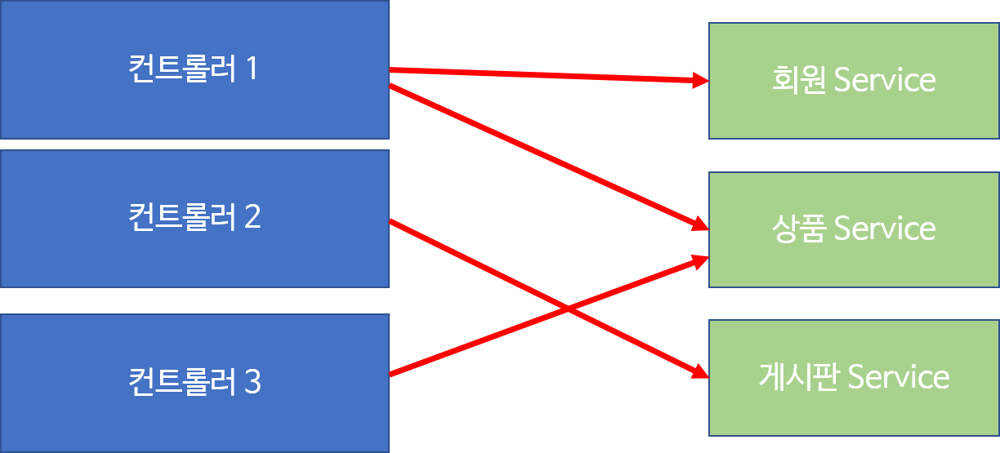

# 41. 레이어드 아키텍쳐

: 웹 페이지는 중복 개발되는 요소가 존재.

- **Controller에서 중복되는 부분을 처리하려면?**
  - 별도의 객체로 분리
  - 별도의 메소드로 분리

: 이렇게 컨트롤러들이 중복적으로 호출되는 부분들을 별도의 객체인 **서비스 객체로 구현**

 

#### [컨트롤러와 서비스]

---

: 서비스 객체는 보통 업무와 관련된 메서드 가지고 있다. (**= 비지니스 메서드**)

: 컨트롤러는 이런 **서비스 객체를 사용하도록 한다**

 

#### [서비스 객체]

----

: 비지니스 로직을 실행하는 메소드를 가지고 있는 객체를 의미.

: 보통 **하나의 비지니스 로직은 하나의 트랜잭션으로 동작**.

 

#### [트랜잭션]

-----

: **하나의 논리적인 작업을 의미**

: 보통 4가지 특징으로 구분 (이 4가지 특징을 모두 가지고 있어야 성립).

1. **원자성 (Atomicity)**

   : 전체가 성공하거나 전체가 실패하는것을 의미

   : 즉, 흐름중에 오류 발생하면 흐름에서 바로 이전흐름으로 돌아가는게 아니라 **앞의 작업 모두 원래대로 복원(rollback) 해야한다**

    

2. **일관성 (Consistency)**

   : 트랜잭션의 작업 처리 결과가 항상 일관성이 있어야 한다
   
   : 트랜잭션 진행중에 데이터 변경되어도 변경된 데이터로 진행되는게 아니라, 처음에 트랜잭션 진행될때 데이터 참고
   
    
   
3. **독립성 (Isolation)**

   : 둘 이상의 트랜잭션이 동시에 병행 실행되고 있을때, 어느 하나의 트랜잭션이라도 다른 트랜잭션의 연산을 끼어들 수 없다

   : 하나의 특정 트랜잭션이 완료될 때까지, 다른 트랜잭션의 결과를 참조 불가능

    

4. **지속성(Durability)**

   : 트랜잭션 성공적으로 완료되었을때 ,결과는 영구적으로 반영

 

#### [JDBC 프로그래밍에서 트랜잭션 처리 방법]

----

: DB 연결후 **Connection 객체의 setAutoCommit 메서도으 false를 파라미터로 지정**

: 입력, 수정, 삭제 **SQL이 실행후 모두 성공**했을때 **Connection이 가지고 있는 commit() 메소드 호출**

