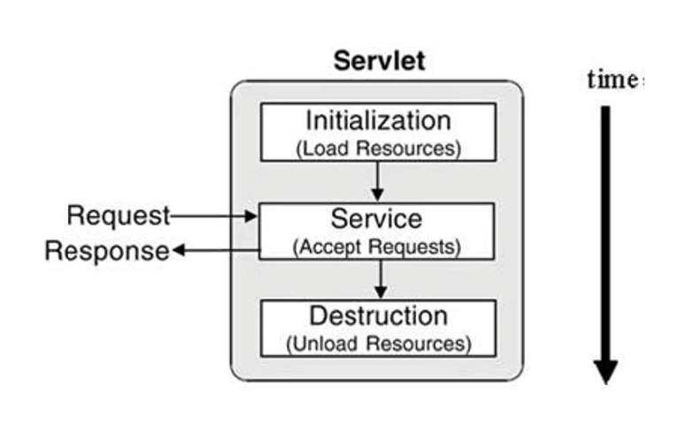

# 5. 서블릿의 라이프사이클

: 생명주기 보기위해 우선 서블릿 생성할때 init, destory, service 메서드를 추가 오버라이드 해준다.

```
package examples;

import java.io.IOException;
import javax.servlet.ServletConfig;
import javax.servlet.ServletException;
import javax.servlet.annotation.WebServlet;
import javax.servlet.http.HttpServlet;
import javax.servlet.http.HttpServletRequest;
import javax.servlet.http.HttpServletResponse;


@WebServlet("/LifeCycleServlet")
public class LifeCycleServlet extends HttpServlet {
	private static final long serialVersionUID = 1L;
       

    public LifeCycleServlet() {
        System.out.println("라이프 사이클 서블릿 생성!");
    }


	public void init(ServletConfig config) throws ServletException {
		System.out.println("init 호출!");
	}


	public void destroy() {
		System.out.println("destory 호출!!");
	}
}
```

1. "라이프 사이클 서블릿 생성"

2. init 호출

3. service 호출 : **새로고침하면 service 호출 메서드만 다시 호출**

4. destory 호출 : 조건부 호출. init 호출의 내용 바뀌면 더이상 기존 서블릿 사용 불가능하기에 destory 호출

   ```
   // 1) 최초 링크 호출
   라이프 사이클 서블릿 생성!
   init 호출!
   서비스 호출!
   
   
   // 2) 링크 새로고침
   서비스 호출!
   
   
   // 3) init 내부 내용 변경
   destory 호출
   ...
   라이프 사이클 서블릿 생성!
   init 호출!
   서비스 호출!
   ```

   

<br>

#### [정리]

-----

- WAS는 서블릿 요청 받으면 해당 서블릿이 메모리에 있는지 확인

- if (메모리에 없음) { 

  해당 서블릿 클래스를 메모리에 올리고 init() 메소드 실행

   }

  service() 메소드 실행

- WAS 종료 되거나 웹 어플리케이션 새롭게 갱신되면 destory()  메소드 실행

<br>

#### [service(request, response) 메소드]

------

: service 오버라이드 안하면 **부모인 HTTPServlet의 service 메소드가 적용되는데 이는 템플릿 메소드 패턴**

: 서블릿은 바로 doGet, doPost 호출하는게 아니라 **service 메소드를 실행**하고 그 내부의 내용에 따라 호출

- 클라이언트의 요청이 GET일 경우 가지고 있는 doGet(request, response) 메소드 호출

- 클라이언트의 요청이 POST일 경우 가지고 있는 doPost(request, response) 메소드 호출
- GET은 가져와서 보여지는 결과, POST는 내가 작성한게 전달된후 새로 보여지는 겨로가

<br>

#### [doGet, doPost 예시]

------

```java
protected void doGet(HttpServletRequest request, HttpServletResponse response) throws ServletException, IOException {
	response.setContentType("text/html;charset=UTF-8");
	PrintWriter out = response.getWriter();
	out.println("<html>");
	out.println("<head><title>form</title></head>");
	out.println("<body>");
	out.println("<form method='post' action='/firstweb/LifecycleServlet'>");
	out.println("name : <input type='text' name='name'><br>");
	out.println("<input type='submit' value='ok'><br>");                                                 
	out.println("</form>");
	out.println("</body>");
	out.println("</html>");
	out.close();
}

protected void doPost(HttpServletRequest request, HttpServletResponse response) throws ServletException, IOException {
	response.setContentType("text/html");
	PrintWriter out = response.getWriter();
	String name = request.getParameter("name");
	out.println("<h1> hello " + name + "</h1>");
	out.close();
}
```
